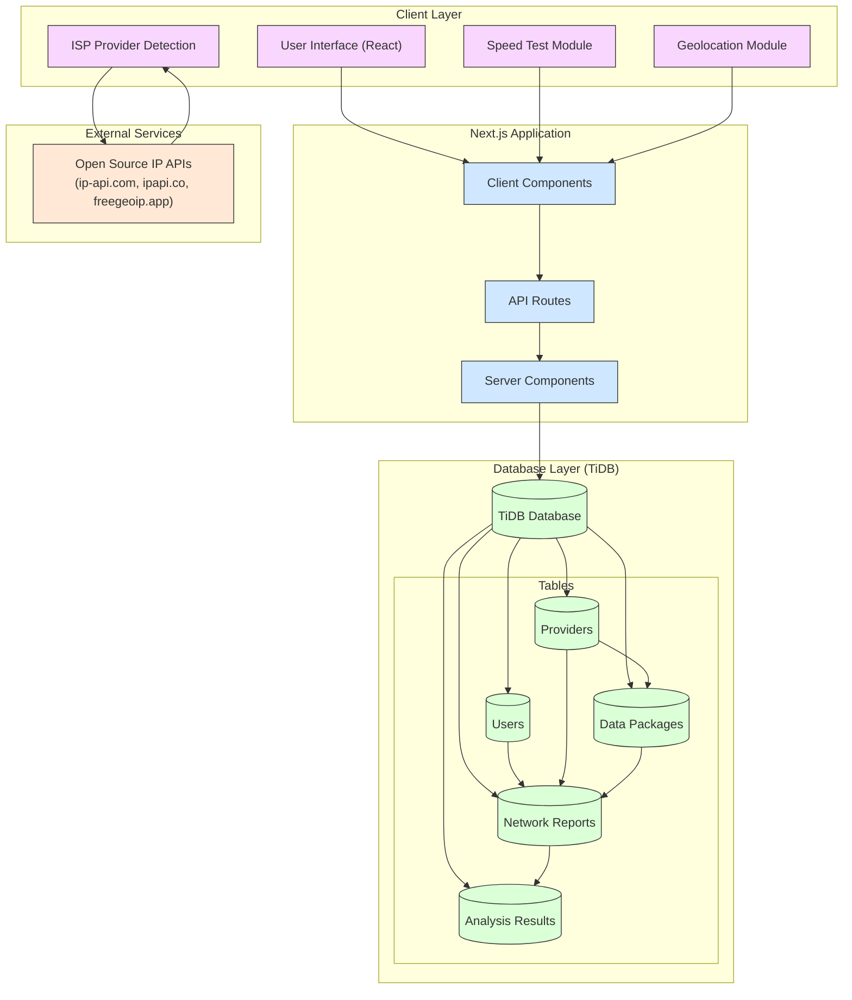
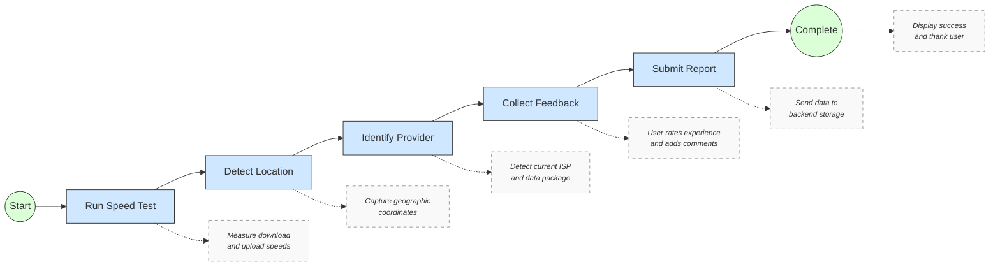
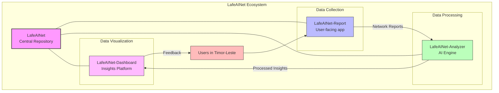

# 🌏 LafeAINet-Report

<div align="center">
  
  
  
  
  
  <br>
  <strong>🏆 Submission for AI for Connectivity Hackathon II: Building Resilient Networks</strong>
</div>

<div align="center">
  <h3>Network connectivity reporting platform for Timor-Leste</h3>
  <h4>Empowering communities with data-driven connectivity insights</h4>
  <p><a href="https://lafeainet-report.vercel.app" target="_blank">View Live Demo →</a></p>
</div>

## 🌟 About LafeAINet-Report

LafeAINet-Report is a user-friendly network quality reporting platform designed specifically for Timor-Leste.

### 💡 Why It Matters

In Timor-Leste, where connectivity is crucial for development but remains challenging across the mountainous terrain:

- **Economic Growth**: Reliable connectivity enables digital business and e-commerce
- **Education Access**: Students need stable internet for remote learning resources
- **Healthcare**: Telemedicine requires dependable networks in remote areas
- **Emergency Response**: Communication networks are vital during natural disasters

## 🚀 Key Features

<table>
  <tr>
    <td width="50%" valign="top">
      <h3>🌡️ Automated Speed Testing</h3>
      <p>Measure download and upload speeds directly in the browser using WebRTC and performance APIs</p>
    </td>
    <td width="50%" valign="top">
      <h3>📍 Location-Based Data</h3>
      <p>Capture geographic coordinates with privacy controls for precise connectivity mapping</p>
    </td>
  </tr>
  <tr>
    <td width="50%" valign="top">
      <h3>🔍 Provider Detection</h3>
      <p>Automatically detect the user's ISP using open-source geolocation APIs</p>
    </td>
    <td width="50%" valign="top">
      <h3>📱 Mobile-First Design</h3>
      <p>Optimized for smartphones, the primary way most Timorese citizens access the internet</p>
    </td>
  </tr>
  <tr>
    <td width="50%" valign="top">
      <h3>🔒 Anonymous Reporting</h3>
      <p>Submit reports without requiring registration or personal information</p>
    </td>
    <td width="50%" valign="top">
      <h3>⚡ Offline Support</h3>
      <p>(Coming soon) Submit reports even in areas with intermittent connectivity</p>
    </td>
  </tr>
</table>

## 📊 System Architecture



LafeAINet-Report follows a modular architecture focused on performance and usability:

### Client Layer

- **User Interface**: React components optimized for mobile devices
- **Speed Test Module**: Browser-based bandwidth measurement
- **Geolocation Module**: Accurate position data with permission controls
- **ISP Provider Detection**: Automatic carrier identification

### Application Layer

- **Client Components**: Interactive UI elements with state management
- **Server Components**: Efficient data processing and validation
- **API Routes**: Secure endpoints for data submission
- **Middleware**: Request validation and error handling

### Database Layer

- **TiDB Database**: Scalable, MySQL-compatible storage
- **Structured Schema**: Optimized for analytics and AI processing

## 📱 User Experience Flow



1. **Begin Report**: User initiates the network reporting process
2. **Speed Test**: Browser measures download and upload speeds
3. **Location Detection**: Captures geographic coordinates with user permission
4. **Provider Detection**: Identifies the current ISP automatically
5. **User Feedback**: Collects qualitative information about network experience
6. **Data Submission**: Sends the complete report to the database
7. **Confirmation**: Provides successful submission feedback

## 🛠️ Technology Stack

<table align="center">
  <tr>
    <td align="center"><strong>Frontend</strong></td>
    <td align="center"><strong>Backend</strong></td>
    <td align="center"><strong>Infrastructure</strong></td>
  </tr>
  <tr>
    <td>
      • React 19<br>
      • TailwindCSS 3.4.1<br>
      • TypeScript 5.0
    </td>
    <td>
      • Next.js API Routes<br>
      • MySQL2 client<br>
      • Open Source IP APIs
    </td>
    <td>
      • TiDB (MySQL-compatible)<br>
      • Vercel/AWS Hosting<br>
      • GitHub CI/CD
    </td>
  </tr>
</table>

## 🔧 Installation and Setup

### Prerequisites

- Node.js 20 or higher
- npm or yarn
- MySQL-compatible database (TiDB recommended)

### Quick Start

1. **Clone the repository**

```bash
git clone https://github.com/ajitonelsonn/lafeainet-report.git
cd lafeainet-report
```

2. **Install dependencies**

```bash
npm install
# or
yarn install
```

3. **Configure environment variables**

Create a `.env.local` file with:

```
DB_HOST=your-database-host
DB_USER=your-database-user
DB_PASSWORD=your-database-password
DB_NAME=db_netrep_tls
DB_PORT=4000
```

4. **Run the development server**

```bash
npm run dev
# or
yarn dev
```

5. **Open your browser**

Navigate to [http://localhost:3000](http://localhost:3000) to see the application.

## 🌱 The LafeAINet Ecosystem



LafeAINet-Analyzer is part of a larger initiative to improve connectivity in Timor-Leste:

- **[LafeAINet](https://github.com/ajitonelsonn/LafeAINet)**: Main repository for the complete ecosystem
- **[LafeAINet-Report](https://github.com/ajitonelsonn/lafeainet-report)**: User-facing app for collecting network reports (this repo)
- **[LafeAINet-Analyzer](https://github.com/ajitonelsonn/lafeainet-analyzer)**: AI engine for processing network data
- **[LafeAINet-Dashboard](https://github.com/ajitonelsonn/lafeainet-dashboard)**: Visualization platform for network insights

## 💡 Real-World Impact

<table>
  <tr>
    <td width="33%" align="center">
      <h3>📊 Data-Driven Planning</h3>
      <p>Enables evidence-based infrastructure investment by telecommunications companies</p>
    </td>
    <td width="33%" align="center">
      <h3>🧩 Gap Identification</h3>
      <p>Highlights underserved areas requiring urgent connectivity improvement</p>
    </td>
    <td width="33%" align="center">
      <h3>📈 Service Improvement</h3>
      <p>Provides feedback to providers for targeted network enhancements</p>
    </td>
  </tr>
</table>

## 🔒 Privacy & Security

LafeAINet-Report prioritizes user privacy:

- **Anonymity**: No personal information or registration required
- **Transparency**: Clear data usage policy displayed before submission
- **Location Control**: Geographic coordinates only collected with explicit permission
- **Data Purpose**: All information used solely for network improvement
- **No Tracking**: No advertising or behavioral tracking implemented

## 👥 Contributors

<table>
  <tr>
    <td align="center">
      <a href="https://github.com/ajitonelsonn">
        
        <br />
        <sub><b>Ajito Nelson</b></sub>
      </a>
    </td>
  </tr>
</table>

## 📜 License

This project is licensed under the [MIT License](LICENSE).

---

<div align="center">
  <p>Built with 💙 for improving connectivity in Timor-Leste</p>
  <p>
    <a href="https://lablab.ai/event/ai-for-connectivity-hackathon-building-resilient-networks">AI for Connectivity Hackathon II</a>
    •
    <a href="https://github.com/ajitonelsonn/LafeAINet">LafeAINet Ecosystem</a>
    •
    <a href="https://lafeainet-report.vercel.app">Live Demo</a>
  </p>
</div>
